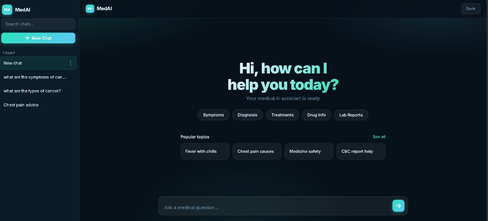
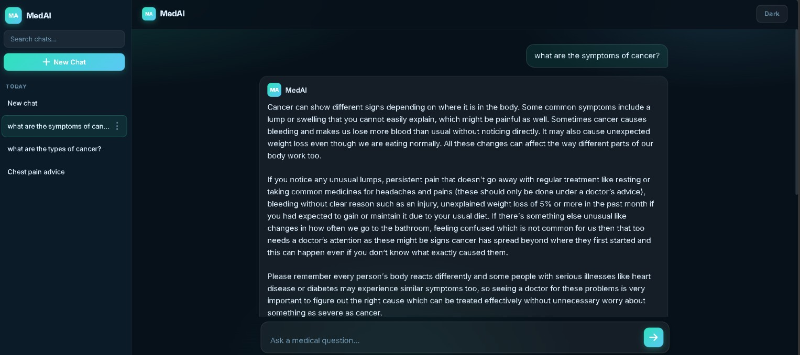
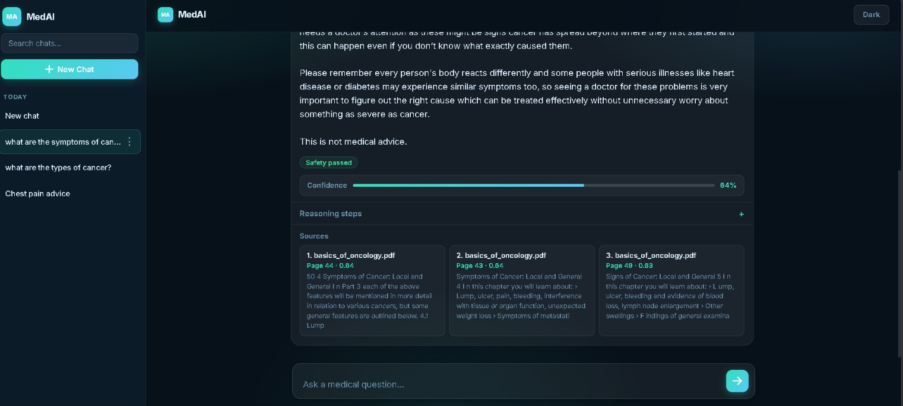

# MedAI

A production-grade Medical Question Answering system built on Retrieval-Augmented Generation (RAG). MedAI retrieves relevant passages from a curated medical knowledge base, reasons over them using a local language model, and returns plain-language answers with source citations and confidence scoring — all running entirely on your machine, with no external API calls.

---

## Overview

MedAI is designed around a straightforward principle: answers should be grounded in real medical literature, not hallucinated. Every response is traceable back to a specific source document and page number. The system also flags low-confidence retrievals and blocks responses that contain unsafe medical advice patterns.

**Key capabilities**

- Semantic search over medical PDFs using dense vector embeddings
- Retrieval-Augmented Generation with FAISS inner-product similarity
- Local LLM inference via Ollama — no cloud dependency
- Safety layer that intercepts dosage instructions and self-harm language
- Confidence scoring per response based on retrieval similarity
- Collapsible reasoning steps and source citations in the UI
- Persistent chat history with rename and delete
- Dark and light theme

---

## Architecture

```
User Question
      |
      v
 EmbeddingService                  sentence-transformers/all-MiniLM-L6-v2
 (query embedding)
      |
      v
 VectorStore.search                FAISS IndexFlatIP
 (top-k retrieval)
      |
      v
 PromptBuilder                     Injects retrieved chunks into prompt
 (context assembly)
      |
      v
 GenerationService                 Ollama  (phi3 / medgemma)
 (LLM inference)
      |
      v
 SafetyChecker                     Regex-based pattern matching
 (response filtering)
      |
      v
 AskResponse                       JSON  ->  Browser UI
 (answer + sources + confidence)
```

---

## Technology Stack

| Layer | Technology |
|---|---|
| Web framework | FastAPI 0.115 + Uvicorn 0.30 |
| Embedding model | sentence-transformers/all-MiniLM-L6-v2 |
| Vector index | FAISS (faiss-cpu 1.13) |
| LLM backend | Ollama (phi3 by default, medgemma supported) |
| PDF ingestion | pdfplumber 0.11 |
| Data validation | Pydantic v2 |
| Frontend | Vanilla HTML / CSS / JavaScript (no framework) |
| Testing | pytest 8.3 |
| Language | Python 3.10+ |

---

## Project Structure

```
MedAI/
├── data/
│   ├── oncology/               Raw PDF source documents
│   └── oncology_mvp/           Subset used for the MVP index
├── src/
│   ├── api/
│   │   ├── main.py             FastAPI app factory, routes
│   │   ├── schemas.py          Pydantic request/response models
│   │   └── static/             Frontend (HTML, CSS, JS)
│   ├── embeddings/
│   │   └── service.py          EmbeddingService (SentenceTransformer + fallback)
│   ├── generation/
│   │   └── service.py          GenerationService (Ollama HTTP client)
│   ├── ingestion/
│   │   ├── build_index.py      CLI entry point for index construction
│   │   ├── chunker.py          Static and semantic dynamic chunking
│   │   ├── cleaner.py          PDF text normalisation
│   │   ├── loader.py           pdfplumber PDF loader
│   │   └── pipeline.py         Orchestrates load -> clean -> chunk
│   ├── prompt/
│   │   └── builder.py          Prompt assembly with context injection
│   ├── retrieval/
│   │   ├── retriever.py        Query embedding + FAISS search
│   │   └── vector_store.py     FAISS index build, save, load
│   ├── safety/
│   │   └── checker.py          Pattern-based safety filtering
│   └── models.py               Shared dataclasses (Chunk, GenerationResult, etc.)
├── vector_db/
│   ├── index.faiss             Serialised FAISS index
│   └── metadata.json           Chunk metadata (source, page, text)
├── tests/                      pytest test suite
├── requirements.txt
└── README.md
```
---

## Screenshots

**Home**



**Chat interface**



**Source citations and confidence**



---

## Demo

[](MedAI-demo_video.mp4)

> Click the image above to watch the demo video, or [download it directly](MedAI-demo_video.mp4).

---

## Prerequisites

- Python 3.10 or higher
- Git
- [Ollama](https://ollama.com) installed and running locally

---

## Setup

### 1. Clone the repository

```bash
git clone https://github.com/2024yuva/MedAI.git
cd MedAI
```

### 2. Create and activate a virtual environment

```bash
python -m venv venv
venv\Scripts\activate        # Windows
# source venv/bin/activate   # macOS / Linux
```

### 3. Install dependencies

```bash
pip install -r requirements.txt
```

### 4. Pull a language model via Ollama

```bash
ollama pull phi3
```

Any model listed in `GenerationService.configured_models` can be used. To switch models, update `primary_model_name` in `src/generation/service.py`.

### 5. Build the vector index

Place your medical PDF files in `data/oncology_mvp/`, then run:

```bash
python -m src.ingestion.build_index --data-dir data/oncology_mvp --out-dir vector_db
```

This extracts text from every PDF, splits it into semantically coherent chunks, embeds each chunk, and writes `vector_db/index.faiss` and `vector_db/metadata.json`.

To use fixed-size chunking instead of semantic chunking:

```bash
python -m src.ingestion.build_index --data-dir data/oncology_mvp --out-dir vector_db --static-chunking
```

### 6. Start the server

```bash
python -m uvicorn src.api.main:app --host 127.0.0.1 --port 8000
```

Open `http://127.0.0.1:8000` in your browser.

---

## API Reference

| Method | Endpoint | Description |
|---|---|---|
| GET | `/` | Serves the web UI |
| GET | `/health` | Overall system health (Ollama reachability, active model) |
| GET | `/health/generation` | Detailed generation backend status |
| POST | `/ask` | Submit a question, receive an answer |
| POST | `/ablation` | Run all 4 ablation experiments for one question |

### POST /ask

**Request**

```json
{
  "question": "What are the early symptoms of lung cancer?"
}
```

**Response**

```json
{
  "answer": "Early symptoms of lung cancer include...",
  "finalAnswer": "Early symptoms of lung cancer include...",
  "reasoningSteps": ["...", "..."],
  "sources": [
    {
      "sourceFile": "basics_of_oncology.pdf",
      "pageNumber": 42,
      "excerpt": "...",
      "similarityScore": 0.87
    }
  ],
  "confidenceScore": 0.87,
  "blocked": false,
  "blockReason": null
}
```

---

## Ablation Study (Professional Report)

Use the built-in ablation runner to compare:
1. Experiment 1: Full pipeline (LAQA + MRL + RAG)
2. Experiment 2: No LAQA
3. Experiment 3: No LAQA + No MRL
4. Experiment 4: No RAG (direct LLM)

### Dataset format

Create a JSON file like `data/ablation_dataset.sample.json`:

```json
[
  {
    "question": "What are the symptoms of lung cancer?",
    "reference": "Common symptoms include persistent cough, coughing blood, chest pain, shortness of breath, unexplained weight loss..."
  }
]
```

### Run study with metrics + graphs

```bash
python -m src.ablation.study --dataset data/ablation_dataset.sample.json --output-dir reports
```

This writes flat result files directly into `reports/`:
- `experiment_1_per_question.csv`, `experiment_1_summary.csv`, `experiment_1_summary.json`
- `experiment_2_per_question.csv`, `experiment_2_summary.csv`, `experiment_2_summary.json`
- `experiment_3_per_question.csv`, `experiment_3_summary.csv`, `experiment_3_summary.json`
- `experiment_4_per_question.csv`, `experiment_4_summary.csv`, `experiment_4_summary.json`
- `ablation_summary.csv`, `ablation_summary.json`
- `quality_metrics.png`
- `latency_breakdown.png`

## Running Tests

```bash
pytest tests/
```

---

## Configuration

| Setting | Location | Default |
|---|---|---|
| LLM model name | `src/generation/service.py` | `phi3` |
| Ollama base URL | `src/generation/service.py` | `http://127.0.0.1:11434` |
| Request timeout | `src/generation/service.py` | 120 seconds |
| Embedding model | `src/embeddings/service.py` | `all-MiniLM-L6-v2` |
| Retrieval top-k | `src/api/main.py` | 3 |
| Chunk size (static) | `src/ingestion/chunker.py` | 500 tokens, 100 overlap |
| Chunk size (dynamic) | `src/ingestion/chunker.py` | 120–420 tokens, similarity threshold 0.72 |
| Vector DB path | `src/api/main.py` | `vector_db/` |

---

## Safety

The `SafetyChecker` scans every generated response before it reaches the user. Responses are blocked if they contain:

- Explicit dosage instructions (e.g. "take 500mg of...")
- Prescription drug names combined with dosage language
- Self-harm or suicide-related language

Blocked responses return a safe fallback message. The system appends a "This is not medical advice" disclaimer to all unblocked responses.

---

## Roadmap

- Support for additional LLMs (Llama 3, Mistral, MedGemma)
- Domain-specific embedding model for improved retrieval accuracy
- Multilingual query support
- Clinical report summarisation
- Voice input interface
- Mobile-optimised deployment

---

## Developer

[2024yuva](https://github.com/2024yuva) - **Yuvarrunjitha R S**  
B.E. Computer Science and Engineering (AI & ML)

---

## License

MIT
